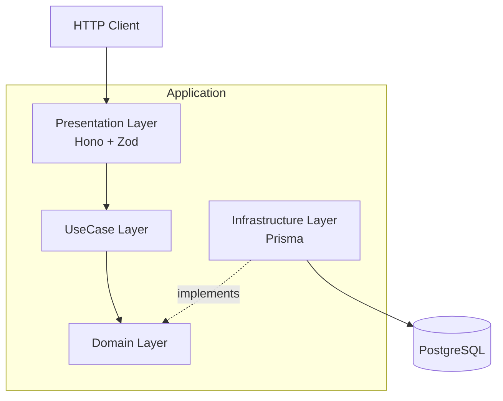
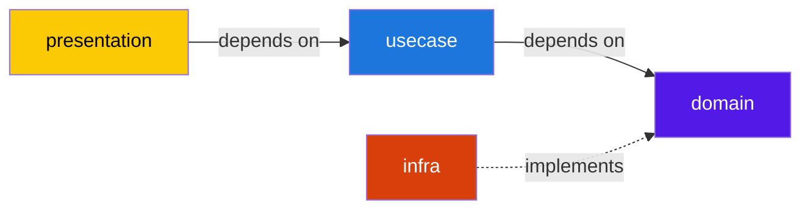
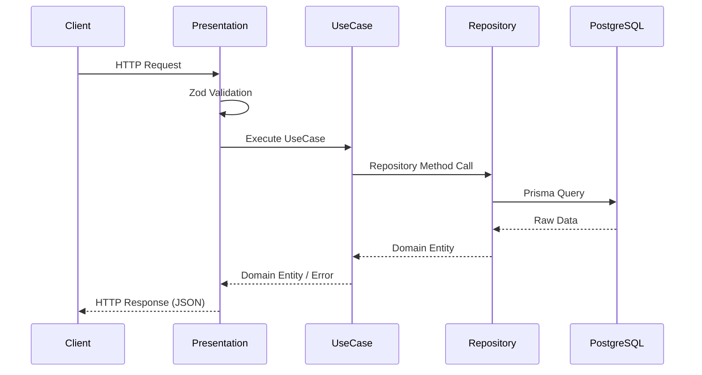

# DDD Issue Tracker

TypeScript + Hono + Prisma + PostgreSQL によるIssue Tracker API。  
DDD（Domain-Driven Design）のレイヤードアーキテクチャを採用し、各層の責務分離を徹底している。

## Architecture



### Dependency Rule



**依存方向は常に内側（domain）へ向かう。** infra層はdomain層のインターフェースを実装するが、domain層はinfra層を知らない。

### Layer Responsibilities

| Layer | Responsibility | Dependencies |
|-------|---------------|--------------|
| **domain** | Entity型定義、Repositoryインターフェース、ドメインエラー | なし（純粋TypeScript） |
| **usecase** | ビジネスフローの調整、1ファイル1ユースケース | domain |
| **infra** | 外部システムとの通信（DB）、Repositoryインターフェースの実装 | domain, Prisma |
| **presentation** | HTTPルーティング、リクエスト/レスポンス変換、バリデーション | usecase, Zod |

## Tech Stack

| Category | Technology | Rationale |
|----------|-----------|-----------|
| Language | TypeScript 5.x (strict) | 型安全性の担保 |
| Runtime | Node.js 22 LTS | 長期サポート、最新ES機能 |
| Framework | Hono | 軽量・高速・型推論に優れたWebフレームワーク |
| ORM | Prisma | 型安全なDB操作、マイグレーション管理 |
| Database | PostgreSQL 16 | 信頼性・拡張性 |
| Validation | Zod | ランタイムバリデーション + 型推論 |
| Test | Vitest | 高速・ESM native・TypeScriptファーストクラス対応 |
| Linter/Formatter | Biome | ESLint + Prettierの統合代替、高速 |
| Package Manager | pnpm | ディスク効率・厳格な依存解決 |
| DI | Manual Constructor Injection | DIコンテナの複雑性を排除 |

## API Endpoints

| Method | Path | Description | Status Codes |
|--------|------|-------------|--------------|
| `POST` | `/issues` | Issue作成 | 201 / 400 |
| `GET` | `/issues` | Issue一覧取得 | 200 |
| `GET` | `/issues/:id` | Issue単体取得 | 200 / 404 |
| `PATCH` | `/issues/:id` | Issue更新 | 200 / 400 / 404 |
| `DELETE` | `/issues/:id` | Issue削除 | 204 / 404 |

### Query Parameters (GET /issues)

| Parameter | Type | Default | Description |
|-----------|------|---------|-------------|
| `status` | `string` | - | `open` \| `closed` でフィルタ |
| `limit` | `number` | `20` | 取得件数上限 |
| `offset` | `number` | `0` | オフセット |

## Request / Response Flow



## Directory Structure

```
src/
├── domain/issue/
│   ├── entity.ts          # Issue型定義
│   ├── repository.ts      # IssueRepository interface
│   └── errors.ts          # IssueNotFoundError
├── usecase/issue/
│   ├── createIssue.ts     # Issue作成
│   ├── getIssue.ts        # Issue単体取得
│   ├── listIssues.ts      # Issue一覧取得
│   ├── updateIssue.ts     # Issue更新
│   └── deleteIssue.ts     # Issue削除
├── infra/prisma/
│   ├── client.ts          # PrismaClient初期化
│   └── issueRepository.ts # IssueRepository実装
├── presentation/http/
│   ├── issueController.ts # Honoルーター
│   └── schemas.ts         # Zodスキーマ
├── container.ts           # DI配線
└── main.ts                # エントリーポイント
prisma/
├── schema.prisma
└── migrations/
tests/
├── usecase/issue/         # UseCase単体テスト
├── fakes/                 # Fake Repository
└── integration/           # 統合テスト
```

## Setup

### Prerequisites

- Node.js 22+
- pnpm 9+
- Docker / Docker Compose

### Installation

```bash
git clone https://github.com/nuko-chan/ddd-issue-tracker.git
cd ddd-issue-tracker
pnpm install
cp .env.example .env
```

### Database

```bash
docker compose up -d
pnpm prisma migrate dev
```

### Development

```bash
pnpm dev          # Start dev server (port 3000)
pnpm build        # TypeScript compile
pnpm lint         # Biome check
pnpm test         # Run all tests
```

## Design Decisions & Trade-offs

### Anemic Domain Model（Phase 1）

Entityにドメインメソッドを持たせず、型定義のみとした。  
**理由**: CRUD中心の本アプリではRich Domain Modelの恩恵が薄い。まず層分離の構造を確立し、ドメインロジックが増えた段階でメソッドを追加する方針。

### DIコンテナ不使用

InversifyなどのDIコンテナを使わず、`container.ts`で手動配線。  
**理由**: 依存グラフが小規模（Repository 1つ、UseCase 5つ）であり、コンテナの学習コスト・マジック感が利点を上回る。依存関係が増えた場合に導入を検討。

### status を String 型で保持

DBスキーマ上はenum制約を設けず、アプリケーション層のunion type (`"open" | "closed"`) で型安全性を確保。  
**理由**: PostgreSQL enumはマイグレーションでのALTER TYPEが煩雑。アプリケーションコードで制御する方がスキーマ変更に柔軟。

### テスト戦略: Fake > Mock

モックライブラリ（jest.mock等）を使わず、手書きのFake Repositoryでテスト。  
**理由**: Fakeはインターフェースの実装であり、テスト対象の振る舞いをより正確に検証できる。モックは実装詳細に結合しやすい。

## License

MIT
