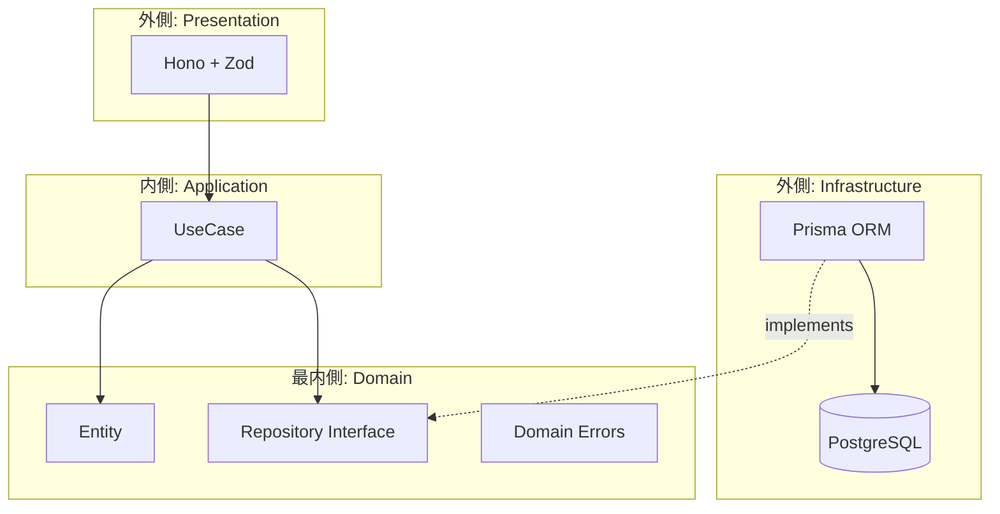
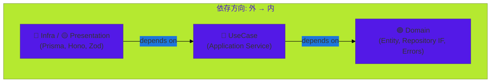
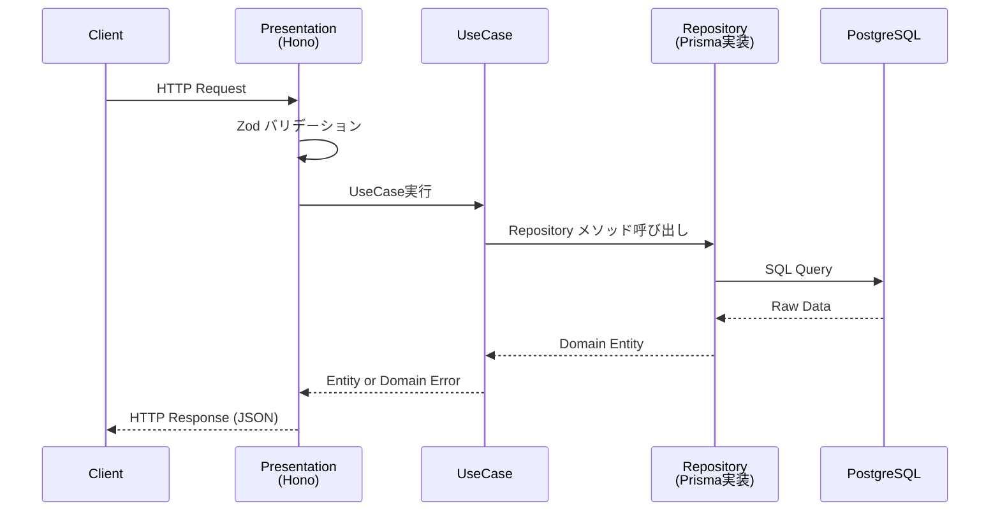

# DDD Issue Tracker

TypeScript + Hono + Prisma + PostgreSQL によるIssue Tracker API。  
オニオンアーキテクチャに基づき、ドメインを中心に据えた依存性逆転の原則（DIP）を実践している。

## アーキテクチャ

### オニオンアーキテクチャ概観



### 同心円モデル



**核心原則**: Domain層は一切の外部依存を持たない。外側の層（Infra / Presentation）が内側のインターフェースに依存する。これにより、DBやフレームワークの差し替えがドメインロジックに影響しない。

### レイヤー責務

| Layer | 位置 | 責務 | 依存先 |
|-------|------|------|--------|
| **Domain** | 最内側 | Entity型、Repository interface、ドメインエラー | なし（純粋TypeScript） |
| **UseCase** | 中間 | ビジネスフロー調整、1ファイル1ユースケース | Domain |
| **Infrastructure** | 外側 | DB通信、Repository interfaceの実装 | Domain, Prisma |
| **Presentation** | 外側 | HTTPルーティング、バリデーション、レスポンス整形 | UseCase, Zod |

## 技術スタック

| カテゴリ | 技術 | 選定理由 |
|----------|------|----------|
| 言語 | TypeScript 5.x (strict) | 型安全性の担保 |
| ランタイム | Node.js 22 LTS | 長期サポート、最新ES機能 |
| フレームワーク | Hono | 軽量・高速・型推論に優れる |
| ORM | Prisma | 型安全なDB操作、マイグレーション管理 |
| DB | PostgreSQL 16 (Docker) | 信頼性・拡張性 |
| バリデーション | Zod | ランタイム検証 + TypeScript型推論 |
| テスト | Vitest | 高速・ESM native |
| Linter/Formatter | Biome | ESLint + Prettier統合代替、高速 |
| パッケージマネージャ | pnpm | ディスク効率・厳格な依存解決 |
| DI | 手動コンストラクタ注入 | DIコンテナの複雑性を排除 |

## APIエンドポイント

| Method | Path | 説明 | Status Codes |
|--------|------|------|--------------|
| `POST` | `/issues` | Issue作成 | 201 / 400 |
| `GET` | `/issues` | Issue一覧取得 | 200 |
| `GET` | `/issues/:id` | Issue単体取得 | 200 / 404 |
| `PATCH` | `/issues/:id` | Issue更新 | 200 / 400 / 404 |
| `DELETE` | `/issues/:id` | Issue削除 | 204 / 404 |

### クエリパラメータ (GET /issues)

| パラメータ | 型 | デフォルト | 説明 |
|-----------|------|-----------|------|
| `status` | `string` | - | `open` \| `closed` でフィルタ |
| `limit` | `number` | `20` | 取得件数上限 |
| `offset` | `number` | `0` | オフセット |

## リクエスト/レスポンスフロー



## ディレクトリ構成

```
src/
├── domain/issue/
│   ├── entity.ts          # Issue型定義
│   ├── repository.ts      # IssueRepository interface
│   └── errors.ts          # IssueNotFoundError
├── usecase/issue/
│   ├── createIssue.ts     # Issue作成
│   ├── getIssue.ts        # Issue単体取得
│   ├── listIssues.ts      # Issue一覧取得
│   ├── updateIssue.ts     # Issue更新
│   └── deleteIssue.ts     # Issue削除
├── infra/prisma/
│   ├── client.ts          # PrismaClient初期化
│   └── issueRepository.ts # IssueRepository実装
├── presentation/http/
│   ├── issueController.ts # Honoルーター
│   └── schemas.ts         # Zodスキーマ
├── container.ts           # DI配線
└── main.ts                # エントリーポイント
prisma/
├── schema.prisma
└── migrations/
tests/
├── usecase/issue/         # UseCase単体テスト
├── fakes/                 # Fake Repository
└── integration/           # 統合テスト
```

## セットアップ

### 前提条件

- Node.js 22+
- pnpm 9+
- Docker / Docker Compose

### インストール

```bash
git clone https://github.com/nuko-chan/ddd-issue-tracker.git
cd ddd-issue-tracker
pnpm install
cp .env.example .env
```

### データベース起動

```bash
docker compose up -d
pnpm prisma migrate dev
```

### 開発

```bash
pnpm dev          # 開発サーバー起動 (port 3000)
pnpm build        # TypeScriptコンパイル
pnpm lint         # Biome check
pnpm test         # 全テスト実行
```

## 設計判断とトレードオフ

### オニオンアーキテクチャ採用

レイヤードアーキテクチャではなくオニオンアーキテクチャを採用。  
**理由**: レイヤードでは上位層が下位層に直接依存するため、DB変更がドメインに波及する。オニオンではDomain層が依存の中心となり、InfraがDomainのインターフェースを実装する（依存性逆転）。これによりテスタビリティとドメインの独立性を確保。

### Anemic Domain Model（Phase 1）

Entityにドメインメソッドを持たせず、型定義のみとした。  
**理由**: CRUD中心の本フェーズではRich Domain Modelの恩恵が薄い。層分離の構造を確立した後、ドメインロジックが増えた段階でメソッドを追加する方針。

### DIコンテナ不使用

InversifyなどのDIコンテナを使わず、`container.ts`で手動配線。  
**理由**: 依存グラフが小規模（Repository 1つ、UseCase 5つ）であり、コンテナのデコレータ・リフレクション等の暗黙的挙動が利点を上回る。規模拡大時に導入を検討。

### statusをString型で保持

DBスキーマ上はenum制約を設けず、アプリケーション層のunion type (`"open" | "closed"`) で型安全性を確保。  
**理由**: PostgreSQL enumは`ALTER TYPE`によるマイグレーションが煩雑。アプリケーションコードで制御する方がスキーマ変更に柔軟。

### テスト戦略: Fake > Mock

モックライブラリを使わず、手書きのFake Repositoryでテスト。  
**理由**: Fakeはインターフェースの完全な実装であり、テスト対象の振る舞いをより正確に検証できる。モックは実装詳細への結合が起きやすい。

## ライセンス

MIT
