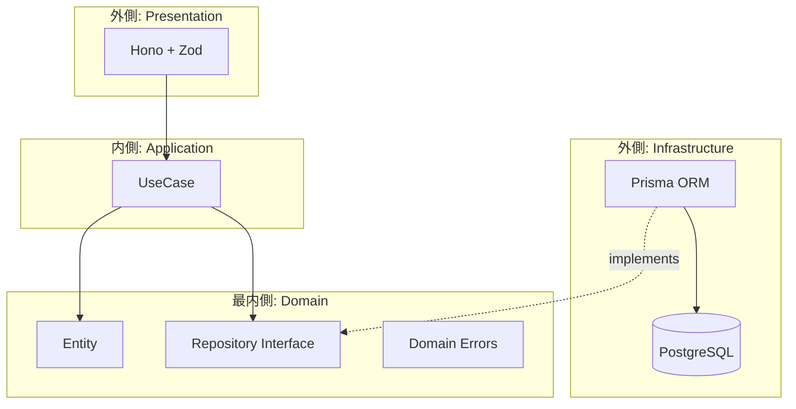
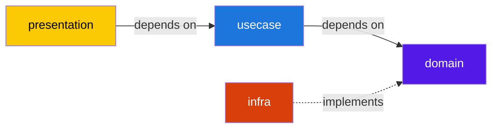
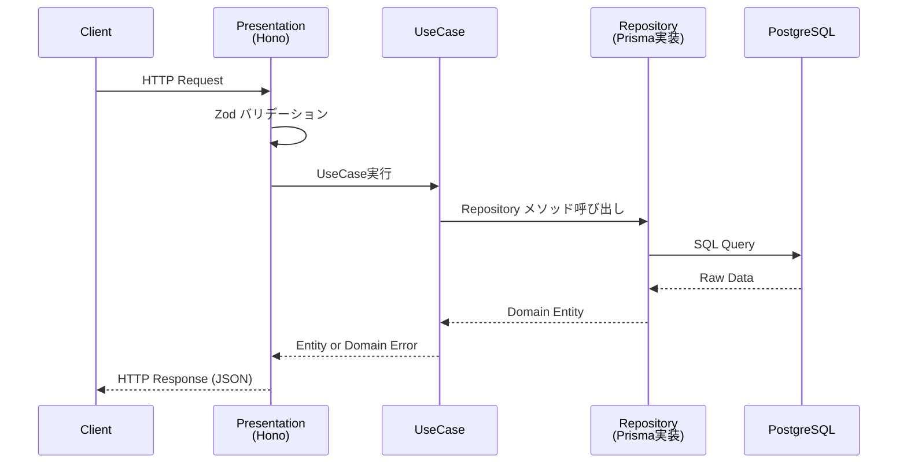

# アーキテクチャ

## オニオンアーキテクチャ

Domain を中心に据え、外側の層が内側のインターフェースに依存する（依存性逆転）。

## レイヤー責務

| Layer | 位置 | 責務 | 依存先 |
|-------|------|------|--------|
| **Domain** | 最内側 | Entity型、Repository interface、ドメインエラー | なし（純粋TypeScript） |
| **UseCase** | 中間 | ビジネスフロー調整、1ファイル1ユースケース | Domain |
| **Infrastructure** | 外側 | DB通信、Repository interfaceの実装 | Domain, Prisma |
| **Presentation** | 外側 | HTTPルーティング、バリデーション、レスポンス整形 | UseCase, Zod |

## 依存方向

**核心原則**: Domain層は一切の外部依存を持たない。外側の層がDomainのインターフェースに依存する。DBやフレームワークの差し替えがドメインロジックに影響しない。

## リクエスト/レスポンスフロー

